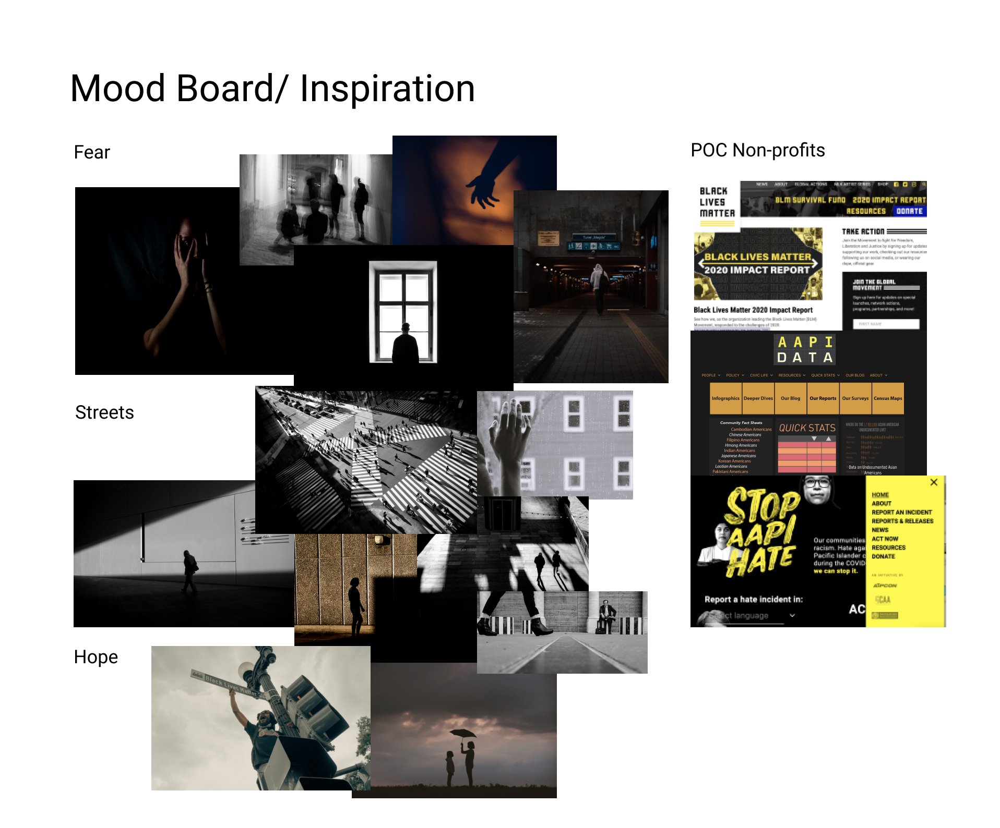

# The Rise of Hate Crimes Against Asian Americans Part II 

This is a continuation of my project. Link to [Part I](Final-Project-Part-I.md)

# Wireframes, Storyboards, Moodboards

I decided to do most of my work on Figma. I kept my moodboard/persona neaby and put most of much research up there. I laso created a wireframe of how I wanted my Shorthand website to look. My wireframe and storyboard can be seen on the figma link and I'll be including all of the text below on a walkthrough there. It should be read from left to right and is in numberical order:
https://www.figma.com/file/3NiMg0c6l1fbFF4nW32XvZ/Rise-of-Hate-Against-Asian-Americans?node-id=6%3A7

As I've mentioned before, my goal is to raise awareness on the rise of hate crimes against Asian Americans and also provide some information on how crimes against Asian Americans are not new. However, because of COVID and certain hate language, these crimes have skyrocketed. A large percentage of them are extermely violent and even involve death. While these crimes are especially shocking, other instances of everyday crimes and acts of discrimination are not as widely as known. Because most Asian Americans are aware of this situation, my audience is the general public. After researching and working more on Part II, I want to also include a little more of an explanation on why this might be happening and how Asian Americans are perceived due to the Model Minority Myth. Additionally, I will be adding more resources such as websites and books.

For my moodboard, I collected photos from Unsplash and tried to evoke certain feelings such as fear and hope. I also looked at some other nonprofit websites for inspiration and to see what kind of information they provide. The persona that I believe most of my audience will have, would be Americans who have heard on some ocassion of these crimes but not to the extent. With these two in mind, I started my wireframe.

To start, my storyboard explains the process I thought the audience would go through starting with "What is this?", learning information and then statistics, and moving to "Why and How did this happen?"  Following from Part I, I decied to use a heat map to distribute the attacks across the US. This gives a pretty high level overview of what's happening and where before moving it into the details. The highest amount of crimes are located in the California and NY, where a large population is Asian American. Moving down, I provide from explanation on why this might be happening because of COVID/rhetoric and going into more detail with the data such as what qualifies as a hate crime and where these events are happening. To continue, I move onto a deeper understanding of why is this happening and some misconceptions about Asian Americans (bringing up the Model Minority Myth and how this is harmful) Finally with my call to action, I provide non-profit links that supporting this cause and sources to go to if you need to report a hate crime.

# User Research & Interviews
For my user interview, I had certain people in mind to ask:
1. Someone who had experience in exploring topics like diversity, so I could raise awareness effectively and navigate a sensitive topic like this.
2. Someone in the design program who could help me more visually and tell me what I was missing from the wire frame.
3. A peer who was would be considered general public, being aware of this situation but not knowing too much about it. 

After hearing feedback from my user interviews, I thought a lot more about how to make this information resonate with my audience. Much of my feedback revolved around how to make this more personal besides infographics. I had briefly mentioned to all of them that I did not want to use photos/videos of victims for privacy reasons but they all suggested ways of bypassing this such as using quotes from articles instead. Other ways I thought were notable were using color and type to draw more emotion.

From my second interview, someone had mentioned if there was overlap between the type of hate crime and reported location. I could try breaking down the location (such as Georgia, NYC) and then separating the crimes from there. They also mentioned how there wasn’t a time frame for the Model Minority Myth section as this has been around for many years.

While the call to action could just be non-profit resources, I thought there should be more than just places for donations. I asked for some suggestions and someone mentioned links to articles and books to learn more. 

# Changes I Will Be Initating
My main goal will be to make the site more personal and get people to be more invested. Without the headlines and photos, I don’t think I get the severity of the attacks across as much as news articles do. Instead, I’ll try to add quotes and numbers from articles and use color and type to create more emotion.

For more details, I will be adding a section for age group. This can also resonate more with people knowing that seniors and children are being attacked. I will also be exploring to data to see if there are any correlations between type and amount of crimes in the state/area.

Lastly, for my call to action, I will be adding resources besides nonprofit organizations such as books and websites. I think sources of information can definitely be helpful, as this was one of the main reasons I wanted to create this site - I didn’t have a go-to for information regarding Asian Hate Crimes.
